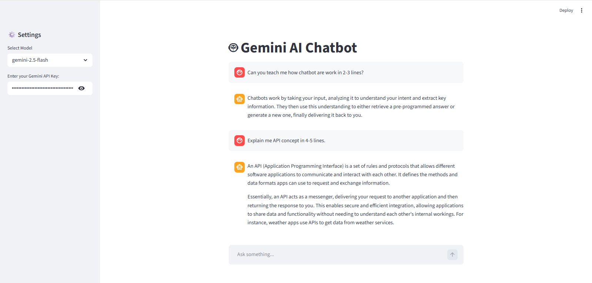

# Gemini AI Chatbot

An AI chatbot built using Google Gemini API and Streamlit.

## Demo



## Live Demo

https://suneel-gemini-chatbot.streamlit.app

## Features
 Conversational AI
- Gemini 2.5 Flash model
- Chat history memory
- Interactive UI with Streamlit
- API key input from UI

## Structure:
```
gemini-chatbot/
│
├── app.py
├── chatbot_gemini.py
├── requirements.txt
└── README.md
```

## Tech Stack
- Python
- Google Gemini API
- Streamlit

## Run Locally

1. Install requirements for run
   
    ```bash
    pip install -r requirements.txt
    ```
2. Start the Server
   
    ```bash
    streamlit run app.py
    ```
